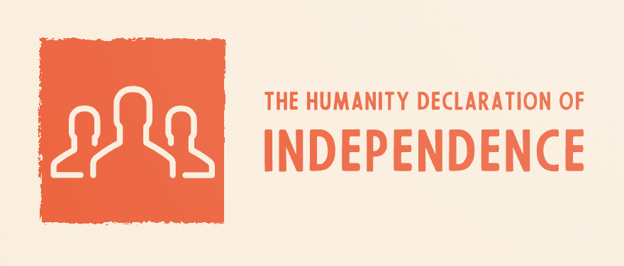

<h1 align="center">
  
   
   
  The Humanity Declaration of Independence
   
   
</h1>

  <a href="./README-en.md">English</a> •
  <a href="./README-esla.md">Español (Latinoamérica)</a>

## Contributing ✨
When contributing to this repository, please first discuss the change you wish to make via issue, email, or any other method with the owners of this repository before making a change.  
Contributions are what make the open-source community such an amazing place to learn, inspire, and create. Any contributions you make are **greatly appreciated** ❤️.  
You can learn more about how you can contribute to this project in the [contribution guide](https://github.com/proyecto26/social-change/blob/master/CONTRIBUTING.md).

## Supporting 🍻
I believe in Unicorns 🦄
Support [me](http://www.paypal.me/jdnichollsc/2), if you do too.

Donate **Ethereum**, **ADA**, **BNB**, **SHIBA**, **USDT/USDC**, **DOGE**, etc:

> Wallet address: jdnichollsc.eth

Please let us know your contributions! 🙏

## License ⚖️
This repository is available under the [MIT License](https://github.com/proyecto26/social-change/blob/master/LICENSE).

## Together we do more, together we are more! 🌐
Thank you for making the world a better place for everyone, the change starts today, be part of the change! 🙏

Made with ❤️

